---
---
一键将 Word 转换为 Markdown
===========================

 

stata连享会 关注

2017.11.09 15:43\* 字数 1332 阅读 2327评论 1喜欢 8

李缘 \| \| Stata 连享会
([知乎](https://link.jianshu.com/?t=https%3A%2F%2Fzhuanlan.zhihu.com%2Farlion) \| [简书](https://www.jianshu.com/u/69a30474ef33) \| [码云](https://link.jianshu.com/?t=https%3A%2F%2Fgitee.com%2Farlionn) \| github)

### 方法一：Writage + Pandoc -- 双剑合璧！

1.  下载并安装 Writage，下载地址：[http://www.writage.com/](https://link.jianshu.com/?t=http%3A%2F%2Fwww.writage.com%2F)

-   打开 Writage网页，点击Download，再点击Download Now完成下载

网页

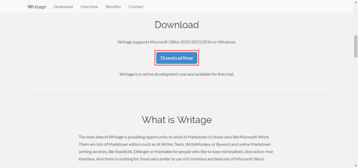

下载

-   运行安装程序，一般按照默认选项安装就好啦

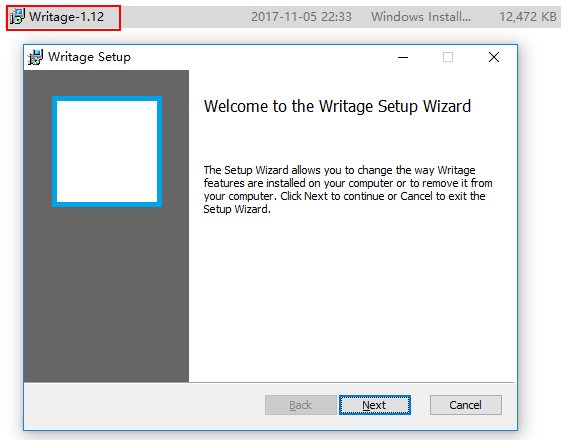

安装

-   重启电脑，新建或打开任一 Word 文档，在 文件 菜单栏下选 另存为，查看 **【保存类型】** 中是否有 Markdown 格式。  
    （如果插件安装成功，就会自动出现Markdown选项；否则，重新安装一遍吧\~）

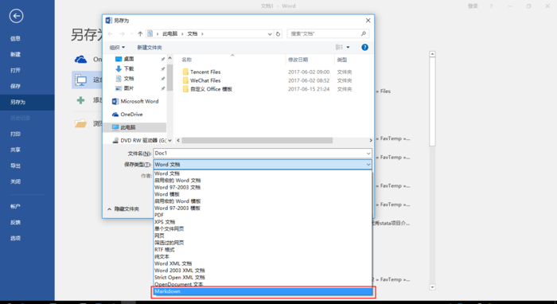

输入图片说明

1.  下载并安装 Pandoc：官方下载地址 ； 百度云下载地址

-   运行安装程序，一般按照默认选项安装就好啦

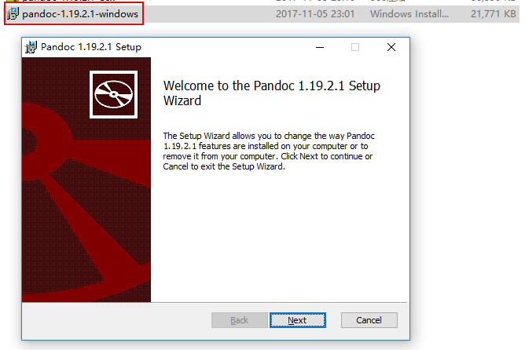

下载

1.  准备好工具啦，我们开始尝试将word文档转换为markdown文档吧！

-   **首先设置 word
    文档中的标准样式**，如一级、二级标题，项目符号或编号等，如此才能与 markdown
    的格式对应  
    （稍微有点繁琐的前期准备，如果文档一开始就是按照标准样式排版，就没有这个烦恼啦）

设置

-   Word 格式 **另存为** Markdown（这是最关键的一步\~）

另存为

-   markdown 文档在 Word 中的显示效果：

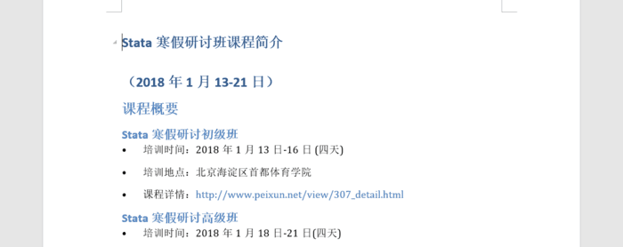

image

由于markdown中的图片无法设置大小，因此在word中排布的图片格式不标准，需要人工调整

其他格式，如一级、二级标题，项目列表等基本没有问题，其中表格显示如下

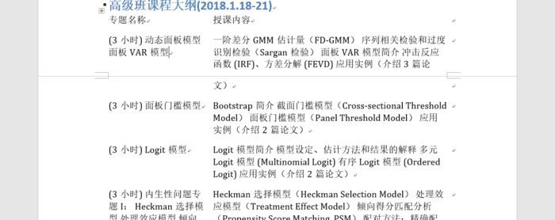

image

-   将markdown文档上传至码云等平台并提交，对应的内容预览效果如下

image

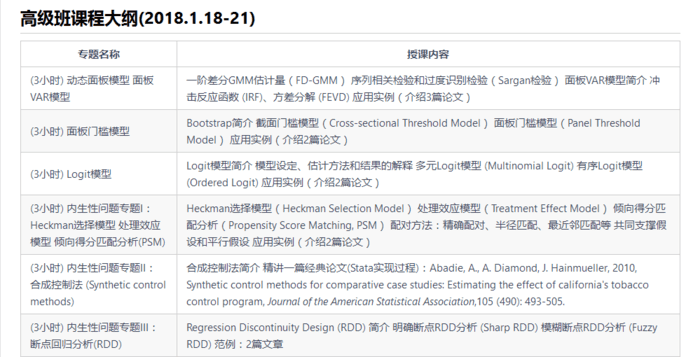

image

4.大功告成啦！ :laughing:

#### 更加快捷（有时略坑）的方法二：Word to Markdown Converter在线转换网页！

1.  **设置word文档中的标准样式，如一级、二级标题，项目符号或编号等，如此才能与markdown的格式对应**

（稍微有点繁琐的前期准备，如果文档一开始就是按照标准样式排版，就没有这个烦恼啦）

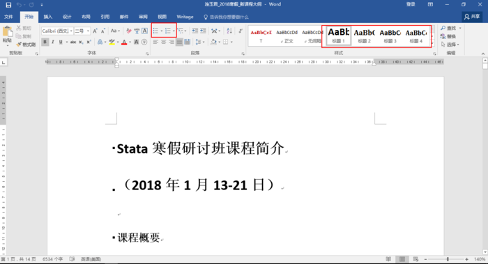

设置

1.  打开网页Word to Markdown
    Converter：[https://word-to-markdown.herokuapp.com/](https://link.jianshu.com/?t=https%3A%2F%2Fword-to-markdown.herokuapp.com%2F)

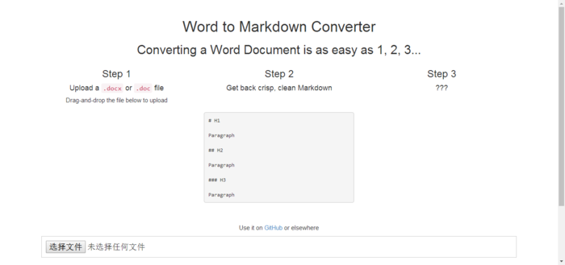

输入图片说明

1.  选择需要转换的Word文件,点击Convert

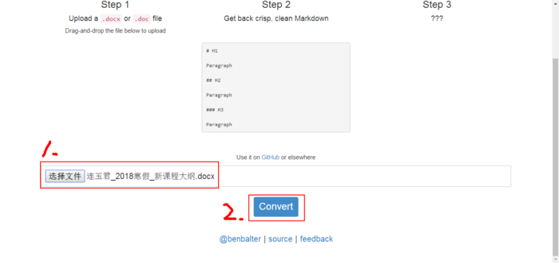

输入图片说明

4.大功告成啦！ :yum:
页面左边显示的是Markdown文档的内容，右边显示的是预览出来的样子

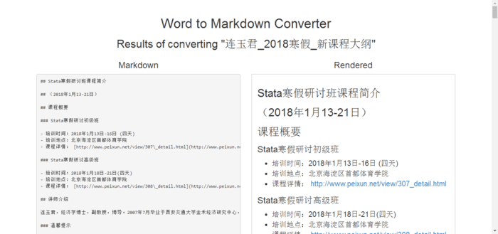

输入图片说明

**那么坑在哪里呢？** 我们会发现，表格转换出来是这样子的 :disappointed:

Markdown文档

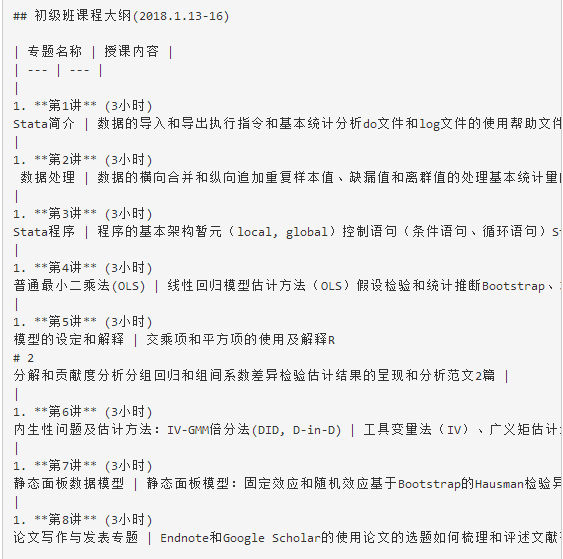

输入图片说明

预览出来

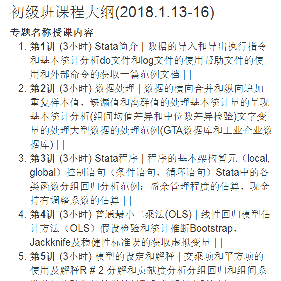

输入图片说明

-   **因此还需要进一步手动编辑整理完善表格**

（如果，Word文档本身不包括表格，Word to Markdown
Converter使用体验可谓相当便捷稳妥啦！）

#### 图片的下载与存储

除了标准格式设置与表格调整问题， **图片的下载与存储**也会是我们可能会遇到的问题

-   **Markdown转换为Word** ：在Markdown文档中，图片以网络超链接的形式保存,如果markdown文档中有这一类图片，那么需要在网络连接的情况下，才能正常输出有图片的word文档。否则，图片处显示空白

-   **Word转换为Markdown** ：Word转换为Markdown文档之后，文档中的图片输出到本地文件夹下，将该文件夹与输出的Markdown文档在同一目录下，在Markdown文档中图片引用本地相对路径，也就是说，必须保证Markdown文档与存放图片的本地文件夹在一起，才能完整的在markdown编辑器中显示图片

参考资料：

[软件技能\|markdown与word相互转换的快捷方法](https://www.jianshu.com/p/f9c5da56e0cb)

[怎么把word转成markdown](https://www.jianshu.com/p/b0be43b03015)